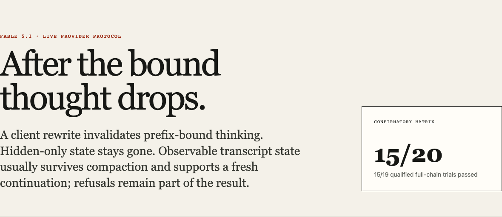
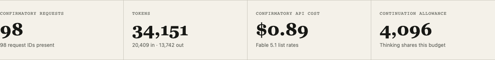
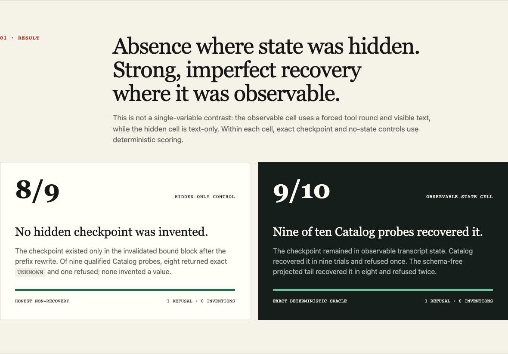
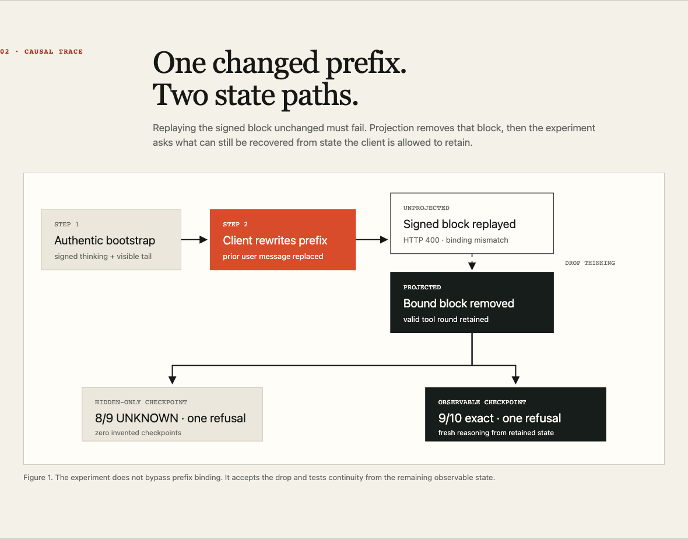
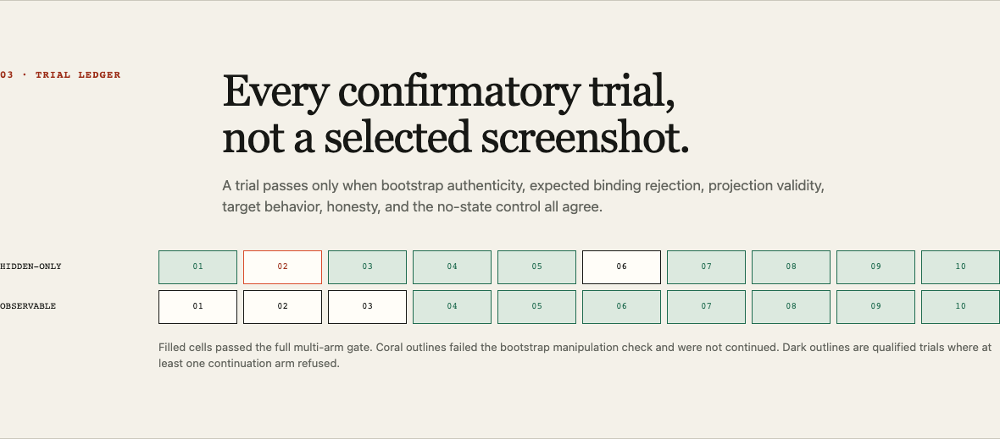
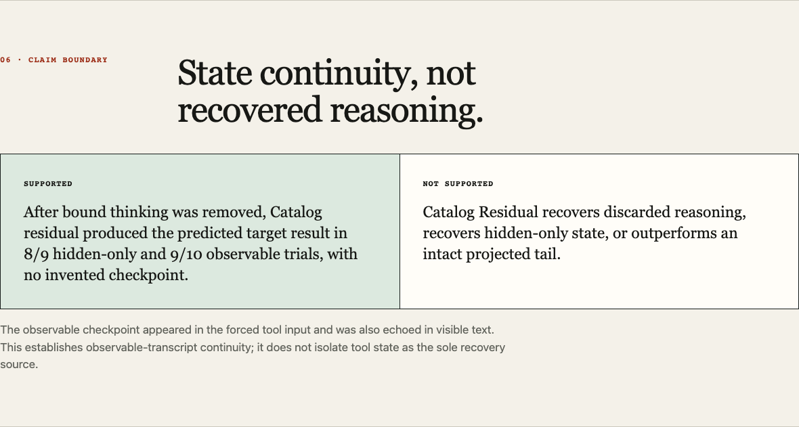

# Fable 5.1 continuity receipts

Selected confirmatory run: 2026-09-02, `claude-fable-5-1`, 20 planned
trials, 19 bootstrap-qualified, 15 full multi-arm causal passes.

Portfolio layout:
[https://professorpalmer.github.io/catalog-residual/fable-5-1-continuity.html](https://professorpalmer.github.io/catalog-residual/fable-5-1-continuity.html)

This page is the audit trail. Numbers come from
[`data/fable-continuity-metrics.json`](data/fable-continuity-metrics.json).
Every request id is hashed. Thinking payloads, signatures, residual
text, and keys are not published.

## Headline

| Gate | Result |
| --- | --- |
| Planned full-chain | 15/20 |
| Qualified full-chain | 15/19 |
| Hidden Catalog residual | 8/9 `UNKNOWN`, 1 refusal, 0 inventions |
| Observable Catalog residual | 9/10 exact, 1 refusal, 0 inventions |
| Hidden projected tail | 9/9 |
| Observable projected tail | 8/10 (schema-free) |
| No-state control | 19/19 `UNKNOWN` |
| Provider requests | 98/98 hashed request ids |
| Tokens | 20,409 in / 13,742 out |
| Confirmatory list-price estimate | $0.8912 |
| Reported ledger spend (self-reported) | $2.7928 |

The planned 15/20 and qualified 15/19 split is intentional. One hidden
bootstrap never planted the checkpoint. Four qualified trials later
refused on a continuation arm. None invented a checkpoint.

## Files

| File | What |
| --- | --- |
| [`data/fable-continuity-metrics.json`](data/fable-continuity-metrics.json) | Aggregate + per-trial public outcomes |
| [`data/fable-continuity-receipt.json`](data/fable-continuity-receipt.json) | Allowlisted per-leg receipt |
| [`data/fable-run-ledger.json`](data/fable-run-ledger.json) | Prior attempts, including failed ones |
| [`fable-5-1-continuity.html`](fable-5-1-continuity.html) | Portfolio page |

Public receipt SHA-256:

```
b2257f547cf065cfbaa3bb1cf8291ffde006186e52de9319022c6d20962dfd8d
```

Source confirmatory artifact SHA-256 (local, not committed):

```
0ef6962c1863d707812ae1759acadcd106817261b1b1f62de5bab77b7404c979
```

```bash
shasum -a 256 docs/data/fable-continuity-receipt.json
python -c "import json; print(json.load(open('docs/data/fable-continuity-metrics.json'))['receipt_sha256'])"
```

Those two strings must match.

## What the protocol tests

A client rewrite changes the prefix of an authentic Fable 5.1
conversation. Replaying the signed thinking block must 400
(`prefix_mismatch_behavior=error`). Projection drops the bound block.
The question is what remains usable from client-visible state.

- Hidden-only: checkpoint exists only in the dropped thinking block.
  Catalog residual and projected tail should answer `UNKNOWN`.
- Observable: checkpoint remains in visible text and a recorded tool
  input. Catalog residual should recover the exact label. Projected
  tail is a second continuation from the projected transcript, without
  tools in the request.

The observable cell is not a single-variable contrast with hidden-only.
It uses a forced tool round plus visible text. The page states that.

## Screenshots













## Claim boundary

Supported: after bound thinking was removed, Catalog residual produced
the predicted target in 8/9 hidden-only and 9/10 observable trials, with
no invented checkpoint.

Not supported: Catalog Residual recovers discarded reasoning, recovers
hidden-only state, or outperforms an intact projected tail.

## Hardening that changed the numbers

1. OpenAI-style `tool_calls` leaked into Anthropic messages and 400'd
   as extra inputs. Serialization now sends only `role` and `content`.
2. Adaptive thinking shares `max_tokens`. Continuation legs use 4,096;
   bootstrap stays at 512. Those budgets are on the receipt.
3. An earlier matrix resent a tool schema whose enum contained the
   checkpoint. The selected run omits tools on projected-tail requests.
   Observable projected-tail recovery fell from 10/10 to 8/10. Catalog,
   which never received that schema, was 9/10.
4. One hidden bootstrap returned a signed thinking block without the
   planted label. It stayed in the planned denominator.

## Ledger

[`data/fable-run-ledger.json`](data/fable-run-ledger.json) is
self-reported local artifacts, not an Anthropic billing export. The
selected confirmatory receipt is
`fable-continuity-confirmatory-v3.json`
(`outcome=full_multi_arm_gate_not_met`). Earlier pilots, a transport
reset, and the schema-confounded 18/20 run remain in the ledger.

## Reproduction

```bash
export PYTHONPATH=/path/to/catalog-residual/lab:/path/to/marionette:/path/to/Puppetmaster
python -m pytest -q lab/tests
python -m catalog_residual.projection --provider-continuity --live \
  --model claude-fable-5-1 --repeats 10 \
  --output artifacts/fable-continuity-confirmatory.json
python -m catalog_residual.publish_fable_continuity \
  artifacts/fable-continuity-confirmatory.json \
  --output-directory docs/data --run-date 2026-09-02
```

Live replay spends real Fable tokens. The committed JSON is the public
record of the 2026-09-02 confirmatory run.
